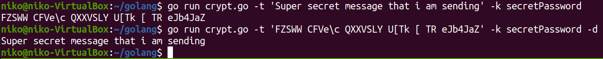

# Golang
This is my homework for the intensive Go programming course taught by Tero Karvinen http://terokarvinen.com/2020/go-programming-course-2020-w22/

```
What crypt.go does is encrypt a given string with the provided key. I think the way it works makes it technically 
Vigenère cipher.
Example usage seen in the image. PS. This is obviously not secure in any way.
```


